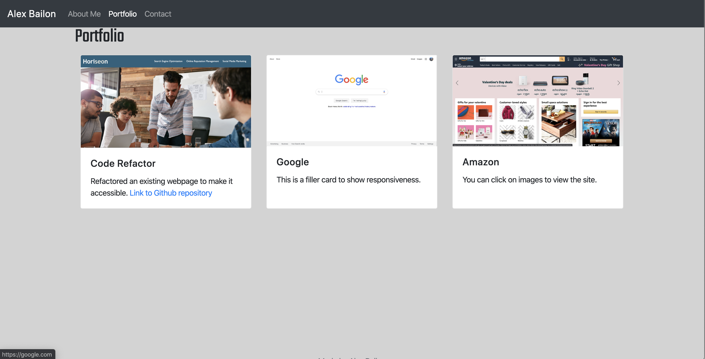

# Alex Bailon Portfolio

## Summary

Hello and welcome to my portfolio.  With this portfolio with the use of Bootstrap I have developed a fully functional and fully responsive webpage. Some of the Bootstrap features used were: 
* Bootstrap grid system (containers, rows and columns)
* Fixed Navbar
* "img-fluid" class for reponsive images
* Cards
* footer (fixed and relative)

## Reponsive Example

Below are images of how the protfolio tab is reponsive on a moblie phone vs a desktop.

Figure 1: Desktop view

\
Figure 2: Moblie View

## Conclusion
This portfolio was created to showcase work that can be done using Bootstrap and how it can be customized to an individual's needs. As time progress I would like to add all my future projects to the portfolio tab.